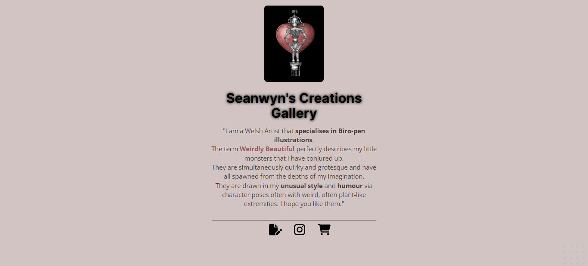

# Campbell Designer

This Project introduce the Campbell's design with a description about his work and sharing portfolio, social media and shop.  The Project's base is from Maratona Explorer 2.0's Model by Rocketseat. 

🔗 [check here](https://kleck-lucena.github.io/campbell-gallery/)

## ⚒️ Tech Applied:
- HTML;
- CSS;

## 👩‍💻 Experience:

🇬🇧 Features addied: visual effects for example hover and opacity on icons link also  background gradient. 
   Main learning: fundamentals of HTML and CSS. 
#
🇧🇷

Página introdutória dos trabalhos do designer Campbell com redirecionamento para o portfólio, instagram e loja.  
O modelo do projeto teve por base o desafio feito no Programa Explorer Rocketseat: Stage 2 - Desafio 1.
Foi aplicado no presente projeto os seguintes conhecimentos: 
  - estrutura básica do HTML; 
  - propriedades básicas de CSS para formatação textual, span, alinhamento e espaçamento dos elementos da página;
  - inclusão de imagens, background e processo de redirecionamento para outra página na web.  
Além do uso de algumas propriedades específicas de CSS tais como: span, strong e text-shadow.  
Por fim, para incrementar o projeto foram acrescentados os efeitos " :hover " e " opacity " aos elementos das  "tags <a> " e background gradiente para melhor harmonização com o tema do projeto.
